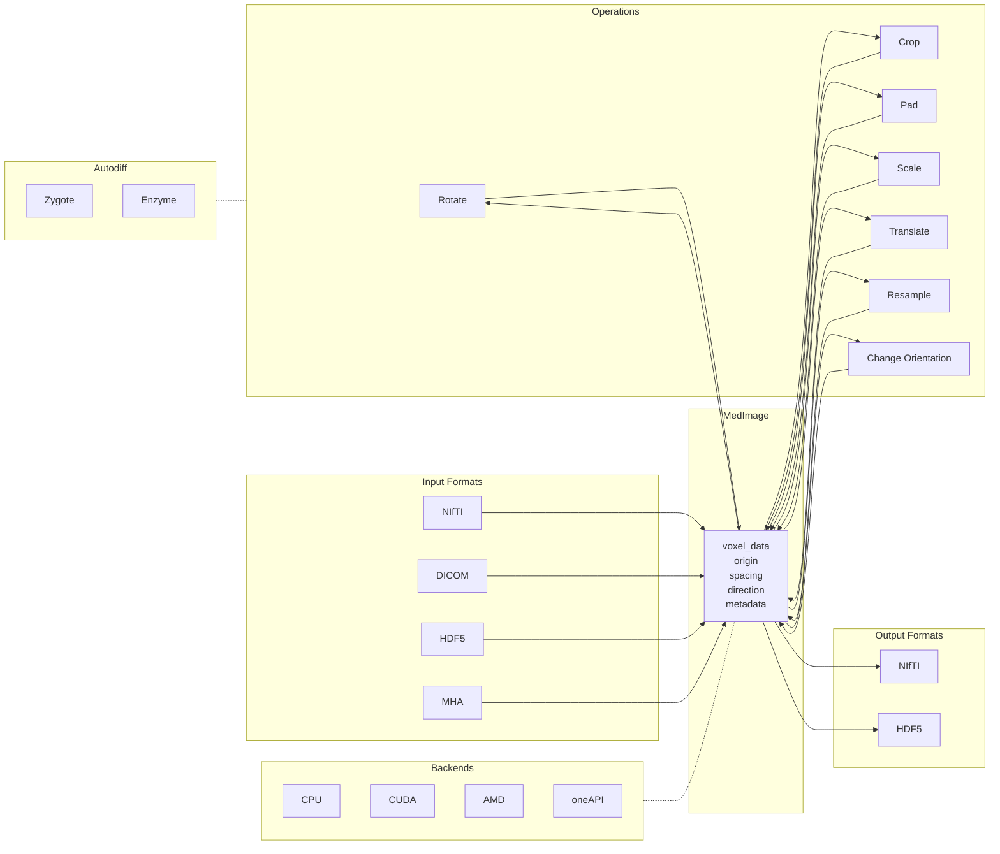

# MedImages.jl

[](https://juliahealth.org/MedImages.jl/stable)
[](https://juliahealth.org/MedImages.jl/dev)
[](https://github.com/JuliaHealth/MedImages.jl/actions/workflows/CI.yml)

A comprehensive Julia library for GPU-accelerated, differentiable medical image processing.

---

## Table of Contents

- [The Challenge](#the-challenge)
- [The Solution](#the-solution)
- [Architecture Overview](#architecture-overview)
- [MedImage Data Structure](#medimage-data-structure)
- [Type Enumerations](#type-enumerations)
- [File I/O Operations](#file-io-operations)
- [Spatial Coordinate System](#spatial-coordinate-system)
- [Orientation Codes](#orientation-codes)
- [Basic Transformations](#basic-transformations)
- [Interpolation Methods](#interpolation-methods)
- [Resampling Operations](#resampling-operations)
- [Cross-Modal Registration](#cross-modal-registration)
- [GPU Backend](#gpu-backend)
- [GPU Usage](#gpu-usage)
- [Differentiability](#differentiability)
- [Gradient Computation](#gradient-computation)
- [Complete Pipeline](#complete-pipeline)
- [API Quick Reference](#api-quick-reference)
- [Quick Start with Docker](#quick-start-with-docker)
- [Contributing](#contributing)
- [References](#references)

---

## The Challenge

Medical imaging in Julia faces several core problems:

- **Format proliferation** -- NIfTI, DICOM, HDF5, and MHA each store metadata differently, forcing per-format parsing logic.
- **Metadata complexity** -- Spatial information (origin, spacing, direction cosines, orientation) is easy to lose or misinterpret during transformations.
- **CPU-only legacy** -- Most existing tools lack GPU acceleration, limiting throughput on large datasets.
- **Non-differentiable operations** -- Standard resampling and geometric transforms break automatic differentiation, blocking integration with deep learning pipelines.

---

## The Solution

MedImages.jl addresses each of these with a unified design:

- **Single data structure** -- One `MedImage` type carries voxel data and all spatial metadata through every operation.
- **Format-agnostic I/O** -- Load and save NIfTI, DICOM, HDF5, and MHA through a common interface.
- **GPU acceleration** -- KernelAbstractions.jl backends enable the same code to run on CPU, CUDA, AMD, and oneAPI devices.
- **Differentiability** -- All resampling and interpolation operations define ChainRulesCore rrules, supporting Zygote and Enzyme for end-to-end gradient computation.
- **Spatial correctness** -- Transformations automatically update origin, spacing, direction, and orientation metadata so downstream code always sees a consistent coordinate system.

---

## Architecture Overview



---

## MedImage Data Structure

The core type wraps voxel data together with all spatial and clinical metadata:

```julia
@with_kw mutable struct MedImage
    voxel_data                              # N-dimensional array (e.g. 512x512x128)
    origin::Tuple{Float64,Float64,Float64}  # World-space origin (mm)
    spacing::Tuple{Float64,Float64,Float64} # Voxel size in each axis (mm)
    direction::NTuple{9,Float64}            # 3x3 direction cosine matrix (row-major)
    image_type::Image_type                  # MRI_type | PET_type | CT_type
    image_subtype::Image_subtype            # T1_subtype | T2_subtype | CT_subtype | ...
    patient_id::String
    date_of_saving::DateTime    = Dates.today()
    acquistion_time::DateTime   = Dates.now()
    current_device::current_device_enum = CPU_current_device
    study_uid::String           = string(UUIDs.uuid4())
    patient_uid::String         = string(UUIDs.uuid4())
    series_uid::String          = string(UUIDs.uuid4())
    study_description::String   = " "
    legacy_file_name::String    = " "
    display_data::Dict{Any,Any} = Dict()
    clinical_data::Dict{Any,Any}= Dict()
    is_contrast_administered::Bool = false
    metadata::Dict{Any,Any}     = Dict()
end
```

---

## Type Enumerations

**Image type:**

| Enum value | Modality |
|---|---|
| `MRI_type` | Magnetic Resonance Imaging |
| `PET_type` | Positron Emission Tomography |
| `CT_type` | Computed Tomography |

**Image subtype:**

| Enum value | Description |
|---|---|
| `CT_subtype` | CT scan |
| `ADC_subtype` | Apparent Diffusion Coefficient |
| `DWI_subtype` | Diffusion Weighted Imaging |
| `T1_subtype` | T1-weighted MRI |
| `T2_subtype` | T2-weighted MRI |
| `FLAIR_subtype` | Fluid-Attenuated Inversion Recovery |
| `FDG_subtype` | FDG PET |
| `PSMA_subtype` | PSMA PET |

**Device:**

| Enum value | Hardware |
|---|---|
| `CPU_current_device` | CPU |
| `CUDA_current_device` | NVIDIA GPU |
| `AMD_current_device` | AMD GPU |
| `ONEAPI_current_device` | Intel oneAPI |

---

## File I/O Operations

```julia
using MedImages

# Load from NIfTI
ct = load_image("scan.nii.gz", "CT")

# Load from DICOM directory
mri = load_image("dicom_dir/", "MRI")

# Save to NIfTI
create_nii_from_medimage(ct, "output.nii.gz")

# Save / load HDF5
save_med_image(ct, "scan.h5")
loaded = load_med_image("scan.h5")
```

---

## Spatial Coordinate System

Every `MedImage` carries three pieces of spatial information that together define how voxel indices map to physical (world) coordinates:

- **Origin** `(x, y, z)` -- the world-space position of voxel `[1,1,1]`, in millimetres.
- **Spacing** `(sx, sy, sz)` -- the distance between adjacent voxels along each axis, in millimetres.
- **Direction** -- a 3x3 matrix (stored as a 9-tuple, row-major) of direction cosines that encode axis orientation and any oblique angulation.

The mapping from voxel index `(i, j, k)` to world coordinate `(x, y, z)` is:

```
world = origin + direction * diag(spacing) * (index - 1)
```

All transformations in MedImages.jl update these fields automatically, so downstream code always sees a consistent coordinate system.

---

## Orientation Codes

Orientation codes describe the anatomical direction each voxel axis points toward. MedImages.jl uses three-letter codes:

| Code | First axis | Second axis | Third axis |
|---|---|---|---|
| `ORIENTATION_RAS` | Right | Anterior | Superior |
| `ORIENTATION_LPS` | Left | Posterior | Superior |
| `ORIENTATION_RAI` | Right | Anterior | Inferior |
| `ORIENTATION_LPI` | Left | Posterior | Inferior |
| `ORIENTATION_RPS` | Right | Posterior | Superior |
| `ORIENTATION_LAS` | Left | Anterior | Superior |
| `ORIENTATION_RPI` | Right | Posterior | Inferior |
| `ORIENTATION_LAI` | Left | Anterior | Inferior |

`ORIENTATION_RAS` is the NIfTI / neuroimaging convention. `ORIENTATION_LPS` is the DICOM convention.

---

## Basic Transformations

All transformations preserve spatial metadata and support automatic differentiation.

```julia
# Rotate 45 degrees around axis 1
rotated = rotate_mi(im, 1, 45.0, Linear_en)

# Crop to a sub-region (start and end indices)
cropped = crop_mi(im, (10, 10, 5), (100, 100, 50), Linear_en)

# Pad with zeros
padded = pad_mi(im, (5,5,5), (5,5,5), 0.0, Linear_en)

# Translate 10 voxels along axis 2
translated = translate_mi(im, 10, 2, Linear_en)

# Scale by 0.5x
scaled = scale_mi(im, 0.5, Linear_en)
```

---

## Interpolation Methods

Choose interpolation based on your use case:

| Method | Speed | Quality | Use case |
|---|---|---|---|
| `Nearest_neighbour_en` | Fast | Discrete | Segmentation masks, label maps |
| `Linear_en` | Medium | Good | General CT/MRI processing |
| `B_spline_en` | Slow | Smooth | High-quality visualization, publication figures |

**Important:** Always use `Nearest_neighbour_en` for segmentation masks to preserve label integrity. Linear and B-spline interpolation will create invalid intermediate values.

---

## Resampling Operations

### Change Resolution

```julia
# Resample to isotropic 1mm spacing
isotropic = resample_to_spacing(ct, (1.0, 1.0, 1.0), Linear_en)

# Resample to specific spacing
resampled = resample_to_spacing(ct, (0.5, 0.5, 2.0), Linear_en)
```

### Change Orientation

```julia
# Convert to neuroimaging standard
ras = change_orientation(ct, ORIENTATION_RAS)

# Convert to DICOM standard
lps = change_orientation(ct, ORIENTATION_LPS)
```

---

## Cross-Modal Registration

Align images from different modalities to a common space:

```julia
# Load CT and PET images
ct  = load_image("ct.nii.gz", "CT")
pet = load_image("pet.nii.gz", "PET")

# Resample PET to match CT geometry
# This aligns origin, spacing, and orientation
aligned_pet = resample_to_image(ct, pet, Linear_en)

# Now both images have identical:
#   - Voxel grid dimensions
#   - Origin coordinates
#   - Spacing values
#   - Direction cosines

# Save aligned result
create_nii_from_medimage(aligned_pet, "pet_aligned_to_ct.nii.gz")
```

This operation is essential for multi-modal analysis, fusion imaging, and preparing training data for deep learning.

---

## GPU Backend

MedImages.jl uses KernelAbstractions.jl for hardware-agnostic GPU kernels:

```
User Code        -->  KernelAbstractions  -->  CUDA.jl
(unchanged)           (dispatch layer)         (GPU backend)
     |                      |                       |
     v                      v                       v
MedImage with         Automatic kernel          Parallel
CuArray data          selection                 execution
```

The same transform functions work on both CPU and GPU data. Backend selection is automatic based on array type.

---

## GPU Usage

```julia
using MedImages
using CUDA

# Load image on CPU
ct = load_image("scan.nii.gz", "CT")

# Transfer to GPU
gpu_ct = deepcopy(ct)
gpu_ct.voxel_data = CuArray(Float32.(ct.voxel_data))
gpu_ct.current_device = GPU_en

# All operations now run on GPU
resampled = resample_to_spacing(gpu_ct, (2.0, 2.0, 2.0), Linear_en)
rotated = rotate_mi(resampled, :z, 45.0, Linear_en)

# Transfer back to CPU for saving
cpu_result = deepcopy(rotated)
cpu_result.voxel_data = Array(rotated.voxel_data)
cpu_result.current_device = CPU_en

create_nii_from_medimage(cpu_result, "output.nii.gz")
```

---

## Differentiability

MedImages.jl supports automatic differentiation through two mechanisms:

**Zygote.jl** -- Reverse-mode AD via ChainRulesCore rrules. Works with standard Julia arrays and integrates with Flux.jl neural networks.

**Enzyme.jl** -- High-performance AD that works with GPU kernels. Required for differentiating through KernelAbstractions code on CUDA.

All resampling and interpolation operations have defined gradients, enabling:

- Spatial transformer networks
- Differentiable rendering
- Image registration with gradient descent
- End-to-end learning with geometric augmentation

---

## Gradient Computation

```julia
using MedImages
using Zygote

# Define a loss function using MedImages operations
function spatial_loss(voxel_data)
    im = MedImage(
        voxel_data = voxel_data,
        origin = (0.0, 0.0, 0.0),
        spacing = (1.0, 1.0, 1.0),
        direction = (1.0, 0.0, 0.0, 0.0, 1.0, 0.0, 0.0, 0.0, 1.0),
        image_type = MRI_type,
        image_subtype = T1_subtype,
        patient_id = "test"
    )

    # Differentiable resampling
    resampled = resample_to_spacing(im, (2.0, 2.0, 2.0), Linear_en)

    # Compute scalar loss
    return sum(resampled.voxel_data .^ 2)
end

# Compute gradients
data = rand(Float32, 64, 64, 64)
grads = Zygote.gradient(spatial_loss, data)
# grads[1] contains dL/d(voxel_data)
```

---

## Complete Pipeline

End-to-end example: load, process, and save a medical image.

```julia
using MedImages

# 1. Load input image
ct = load_image("input_ct.nii.gz", "CT")
println("Original shape: ", size(ct.voxel_data))
println("Original spacing: ", ct.spacing)

# 2. Resample to isotropic 1mm resolution
isotropic = resample_to_spacing(ct, (1.0, 1.0, 1.0), Linear_en)
println("Isotropic shape: ", size(isotropic.voxel_data))

# 3. Reorient to standard neuroimaging convention
ras = change_orientation(isotropic, ORIENTATION_RAS)

# 4. Crop to brain region (example coordinates)
cropped = crop_mi(ras, (50, 30, 20), (160, 200, 180), Linear_en)

# 5. Apply rotation for alignment
aligned = rotate_mi(cropped, :z, 5.0, Linear_en)

# 6. Save processed result
create_nii_from_medimage(aligned, "processed_ct.nii.gz")
println("Processing complete")
```

---

## API Quick Reference

### Core Functions

| Function | Description |
|---|---|
| `load_image(path, type)` | Load NIfTI or DICOM files |
| `create_nii_from_medimage(im, path)` | Export to NIfTI format |
| `save_med_image(im, path)` | Save to HDF5 |
| `load_med_image(path)` | Load from HDF5 |
| `resample_to_spacing(im, spacing, interp)` | Change voxel resolution |
| `change_orientation(im, code)` | Change voxel axis ordering |
| `resample_to_image(fixed, moving, interp)` | Align moving to fixed geometry |
| `rotate_mi(im, axis, angle, interp)` | 3D rotation around axis |
| `crop_mi(im, start, size, interp)` | Crop with origin adjustment |
| `pad_mi(im, before, after, val, interp)` | Pad with origin adjustment |
| `translate_mi(im, offset, axis, interp)` | Translate along axis |
| `scale_mi(im, factor, interp)` | Uniform scaling |

### Interpolation Constants

- `Nearest_neighbour_en` -- Discrete values, fast
- `Linear_en` -- Smooth interpolation, balanced
- `B_spline_en` -- High quality, slower

### Orientation Constants

- `ORIENTATION_RAS` -- Neuroimaging standard (NIfTI)
- `ORIENTATION_LPS` -- DICOM standard
- `ORIENTATION_RAI`, `ORIENTATION_LPI`, `ORIENTATION_RPS`, `ORIENTATION_LAS`, `ORIENTATION_RPI`, `ORIENTATION_LAI`

---

## Quick Start with Docker

The easiest way to get started is using Docker with GPU support for benchmarks.

### Prerequisites

- Docker with NVIDIA GPU support (for GPU benchmarks)
- Or Docker without GPU (CPU-only mode available)

### Build and Run

```bash
# Build the Docker image
make build

# Start interactive Julia REPL (with GPU)
make shell

# Start interactive Julia REPL (CPU only)
make shell-cpu
```

### Run Tests

```bash
# Run the full test suite
make test

# Run tests in CPU-only mode
make test-cpu
```

### Run Benchmarks

```bash
# Run GPU benchmarks (uses synthetic data)
make benchmark

# Run CPU-only benchmarks
make benchmark-cpu

# Custom benchmark options
make benchmark-custom ARGS="--size 64 --iterations 5"
```

### Verify Setup

```bash
# Check CUDA/GPU availability
make check-cuda

# Check Python/SimpleITK setup
make check-python

# Run quick start verification
./scripts/quick-start.sh
```

### Test Data

Test data files are expected in `test_data/`:

- `volume-0.nii.gz` - Primary NIfTI test file
- `synthethic_small.nii.gz` - Synthetic test file
- `ScalarVolume_0/` - DICOM test directory

```bash
# Check test data availability
./scripts/check-test-data.sh

# Download benchmark data from TCIA
make download-data

# Convert DICOM to NIfTI for benchmarks
make convert-data
```

Note: Benchmarks use synthetic data by default (`make benchmark`). Real data download is only needed for `make benchmark-full`.

### All Make Commands

```bash
make help  # Show all available commands
```

---

## Contributing

Contributions are welcome. If you have expertise in medical imaging, particularly ultrasonography, or experience with the technical challenges described above, please consider getting involved.

---

## References

[1] Gorgolewski, K.J., Auer, T., Calhoun, V.D. et al. The brain imaging data structure, a format for organizing and describing outputs of neuroimaging experiments. Sci Data 3, 160044 (2016). https://www.nature.com/articles/sdata201644
