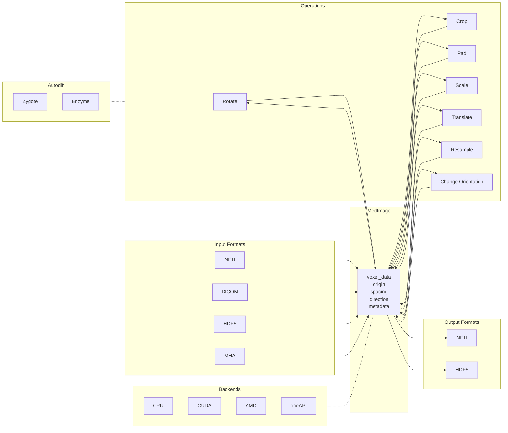

# MedImages.jl

[](https://juliahealth.org/MedImages.jl/stable)
[](https://juliahealth.org/MedImages.jl/dev)
[](https://github.com/JuliaHealth/MedImages.jl/actions/workflows/CI.yml)

GPU-accelerated, differentiable medical image processing in Julia. Unified I/O for NIfTI, DICOM, HDF5, and MHA with automatic spatial metadata management.

---

## Architecture



---

## Quick Start

```julia
using MedImages
ct = load_image("scan.nii.gz", "CT")
resampled = resample_to_spacing(ct, (1.0, 1.0, 1.0), Linear_en)
create_nii_from_medimage(resampled, "output.nii.gz")
```

---

## MedImage Data Structure

All fields travel with the voxel data through every operation:

| Field | Type | Description |
|---|---|---|
| `voxel_data` | Array | N-dimensional image array |
| `origin` | `NTuple{3,Float64}` | World-space position of first voxel (mm) |
| `spacing` | `NTuple{3,Float64}` | Voxel size per axis (mm) |
| `direction` | `NTuple{9,Float64}` | 3x3 direction cosines (row-major) |
| `image_type` | `Image_type` | `MRI_type`, `PET_type`, `CT_type` |
| `image_subtype` | `Image_subtype` | `T1_subtype`, `CT_subtype`, etc. |
| `patient_id` | `String` | Patient identifier |
| `current_device` | `current_device_enum` | `CPU_current_device`, `CUDA_current_device` |

Additional fields: `date_of_saving`, `acquistion_time`, `study_uid`, `patient_uid`, `series_uid`, `study_description`, `legacy_file_name`, `display_data`, `clinical_data`, `is_contrast_administered`, `metadata`.

---

## I/O

```julia
ct  = load_image("scan.nii.gz", "CT")          # NIfTI
mri = load_image("dicom_dir/", "MRI")           # DICOM
create_nii_from_medimage(ct, "out.nii.gz")       # Export NIfTI
save_med_image(ct, "scan.h5")                    # Save HDF5
```

---

## Transformations

All transforms preserve spatial metadata and are differentiable.

```julia
rotated    = rotate_mi(im, 1, 45.0, Linear_en)
cropped    = crop_mi(im, (10,10,5), (100,100,50), Linear_en)
padded     = pad_mi(im, (5,5,5), (5,5,5), 0.0, Linear_en)
translated = translate_mi(im, 10, 2, Linear_en)
```

---

## Resampling and Orientation

```julia
isotropic = resample_to_spacing(ct, (1.0, 1.0, 1.0), Linear_en)
ras       = change_orientation(ct, ORIENTATION_RAS)
aligned   = resample_to_image(ct, pet, Linear_en)
```

`resample_to_image` aligns a moving image to a fixed image's geometry (grid dimensions, origin, spacing, direction). Essential for multi-modal fusion and deep learning data preparation.

---

## Interpolation

| Method | Speed | Best for |
|---|---|---|
| `Nearest_neighbour_en` | Fast | Segmentation masks, label maps |
| `Linear_en` | Medium | General CT/MRI |
| `B_spline_en` | Slow | Publication figures |

Always use `Nearest_neighbour_en` for segmentation masks to preserve label integrity.

---

## Spatial Coordinates

Voxel-to-world mapping: `world = origin + direction * diag(spacing) * (index - 1)`

Orientation codes follow the three-letter anatomical convention. `ORIENTATION_RAS` (NIfTI standard) and `ORIENTATION_LPS` (DICOM standard) are the most common. All eight combinations of R/L, A/P, S/I are supported.

---

## GPU

Backend selection is automatic via KernelAbstractions.jl. The same functions work on CPU and GPU.

```julia
using CUDA
gpu_ct = deepcopy(ct)
gpu_ct.voxel_data = CuArray(Float32.(ct.voxel_data))
rotated = rotate_mi(gpu_ct, :z, 45.0, Linear_en)
```

---

## Differentiability

All resampling and interpolation operations define ChainRulesCore rrules, enabling end-to-end gradient computation through geometric transforms.

- **Zygote.jl** -- reverse-mode AD, integrates with Flux.jl
- **Enzyme.jl** -- high-performance AD for GPU kernels

```julia
using Zygote
grads = Zygote.gradient(data) do x
    sum(resample_to_spacing(make_medimage(x), (2.0,2.0,2.0), Linear_en).voxel_data)
end
```

---

## API Reference

| Function | Description |
|---|---|
| `load_image(path, type)` | Load NIfTI or DICOM |
| `create_nii_from_medimage(im, path)` | Export NIfTI |
| `save_med_image(im, path)` / `load_med_image(path)` | HDF5 I/O |
| `resample_to_spacing(im, spacing, interp)` | Change resolution |
| `resample_to_image(fixed, moving, interp)` | Align to target geometry |
| `change_orientation(im, code)` | Reorient axes |
| `rotate_mi(im, axis, angle, interp)` | 3D rotation |
| `crop_mi(im, start, size, interp)` | Crop |
| `pad_mi(im, before, after, val, interp)` | Pad |
| `translate_mi(im, offset, axis, interp)` | Translate |
| `scale_mi(im, factor, interp)` | Scale |

---

## Docker

```bash
make build       # Build image
make shell       # Julia REPL with GPU
make shell-cpu   # Julia REPL, CPU only
make test        # Run test suite
make benchmark   # GPU benchmarks (synthetic data)
make help        # All commands
```

Test data goes in `test_data/`. Run `make download-data` for real benchmark data.

---

## Contributing

Contributions are welcome, particularly from those with medical imaging or ultrasonography expertise.

## References

[1] Gorgolewski et al. The brain imaging data structure. Sci Data 3, 160044 (2016). https://www.nature.com/articles/sdata201644
